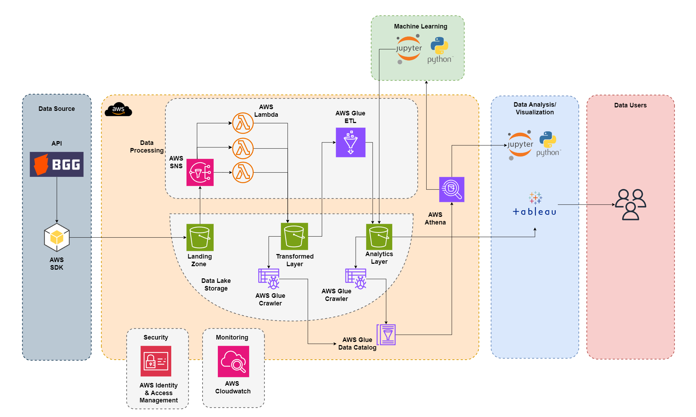
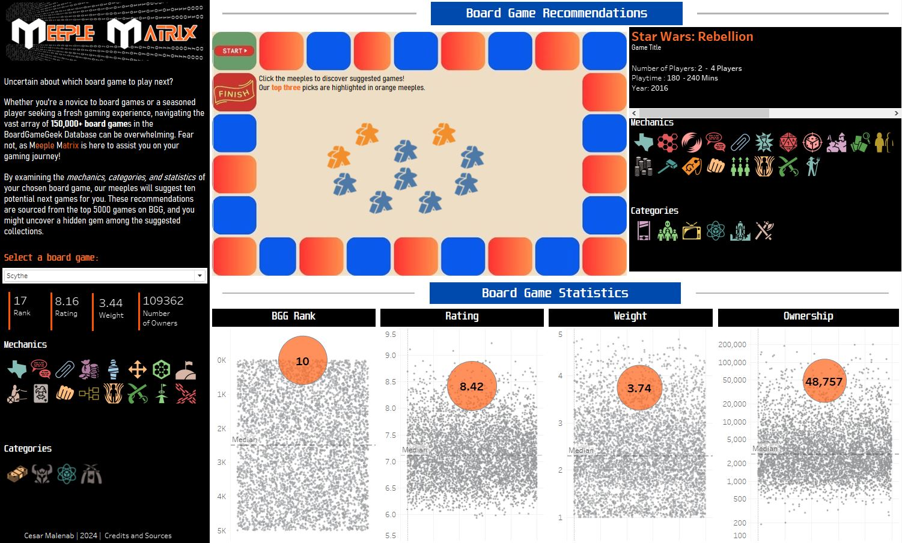

# BoardGameGeek Content-based Recommender Data Pipeline using AWS

The remarkable growth of board gaming industry has created a dynamic landscape where players, ranging from new comers up to board game collectors, are now presented with an array of options for their next gaming adventure. From this growing consumer interest, innovative game designs, and social interaction that board gaming promotes, it is projected that this industry will still further grow in the coming years. With thousands of games released annually, [BoardGameGeek (BGG)](https://boardgamegeek.com/) stands as the definitive hub where players can discover, discuss, and review board games of all genres and complexities. 

The objective of this project is to establish a comprehensive data pipeline spanning from data collection up to dashboard visualization, leveraging the extensive database of BoardGameGeek. Additionally, a recommendation model is developed to identify similar games based on the mechanics and categories on a specific board game. The outlined system architecture emphasizes the use of Amazon Web Services (AWS) to streamline the processing, storage, and retrieval of the dataset utilized in this project.

## Summary

* Performed web scraping of all board game identifiers in [BoardGameGeek](https://boardgamegeek.com/browse/boardgame) and obtained all features, such as statistics, classification, and ranking, using the [BGG API](https://boardgamegeek.com/wiki/page/BGG_XML_API2).
* Developed an AWS Framework to streamline data processing up to storage in the data lake.
* Analyzed trends, feature dependencies, and correlations of the dataset by conducting a comprehensive Exploratory Data Analysis.
* Created a content-based recommendation model using Inverse-Document Frequency (IDF) to find similar games based on mechanics and categories of each board game.
* Visualized the statistics and recommendations for a particular board game using Tableau.

## Tools

* AWS
    * Services - S3, Glue, Lambda, IAM, CloudWatch, Athena, SNS 
    * SDK - boto3, awswrangler
* Python Libraries
    * Data analysis - pandas, numpy, seaborn, matplotlib
    * Webscraping - selenium, beautifulsoup
* Visualization
    * [Tableau](https://public.tableau.com/app/profile/cesar.malenab/viz/BoardGameGeek_2/Dashboard1)

## Notebooks

* AWS Architecture - discusses each step in the data pipeline from the collection of XML files from the API, transforming the data using AWS Glue and AWS Lambda, storing the data in the data lake.
* BGG Exploratory Data Analysis - contains a comprehensive analysis of features employing data wrangling up to multivariate analysis to develop insights with the collected data.
* Content-Based Recommender Model - the notebook covers the step-by-step process involve in finding game recommendations using IDF of mechanics and categories.

## Dashboard

Please check out the BGG recommender dashboard on [Tableau Public](https://public.tableau.com/app/profile/cesar.malenab/viz/BoardGameGeek_2/Dashboard1) and feel free to explore its interactive features!

